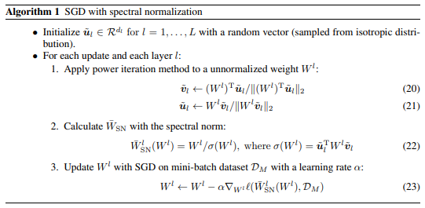

# Spectral Normalization TF2
Spectral Normalization implemented as Tensorflow 2.0

## TODO
- [ ] Convert simple conv2d model to DCGAN model

## Run Test Code
This is currently a test code using a simple image classification model.
```
python main.py
```

## Algorithm


## How to use
1. Sequential API 
```
from sn import SpectralNormalization

model = models.Sequential()
model.add(SpectralNormalization(layers.Conv2D(32, (3, 3), activation='relu')))
...
```

2. Functional API
```
from sn import SpectralNormalization

inputs = layers.Input(shape=(28,28,1))
x = SpectralNormalization(layers.Conv2D(32, (3, 3), activation='relu'))(inputs)
...
````

3. Custom Layer Method 
```
from sn import SpectralNormalization

class CustomLayer(tf.keras.layers.Layer):
    def __init__(self):
        self.conv2DSN = SpectralNormalization(layers.Conv2D(32, (3, 3), activation='relu'))
        ...
    
    def call(self, inputs):
        x = self.conv2DSN(inputs)
        ...
```

## Rerference
[Spectral Normalization for Generative Adversarial Networks](https://arxiv.org/abs/1802.05957)
